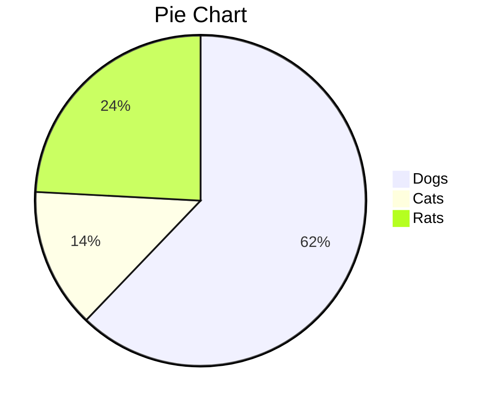

<object style="aspect-ratio: 1 / 1" width="100%" 
data="https://www.youtube.com/embed/exaok6JTy5k?si=JHc-hdwDLb1bg_o7">
</object> 

This great nutritional whole food breakfast will power your morning delightfully! Follow this tutorial to get the most out of your breakfast!

**1 Serving, 85g**

---

- *4* eggs
- *1* small head broccoli
- *2 tbsp* olive oil
- himalayan salt to taste

---

1. Heat 1 tbsp olive oil in a pan until it starts to shimmer
2. 

___

Nutrition Facts

